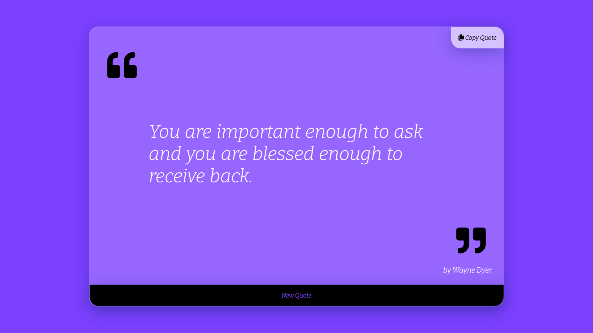

## Are looking for some best quotes?
## Then please click on link below
### [Quote Generator]()

<hr>

## Here are some screen shots

<p align="center">
  
  <br>
  
</p>

<hr>

## Editor used 


## Built with 
 
 
 
 
 

 <hr>

 ## Cloning this repositary using command line
 1. Open **Git Bash**.
 1. Change the current working directory to the location where you want the cloned directory.
 1. Type `git clone https://github.com/Sagar-Sharma-7/Quotes-Generator`
 1. Press **Enter** to create the clone of this repositary.

 <hr>

 ## Dependency - Font Awesome 
 ```html 
<link rel="stylesheet" href="https://cdnjs.cloudflare.com/ajax/libs/font-awesome/5.15.3/css/all.min.css" integrity="sha512-iBBXm8fW90+nuLcSKlbmrPcLa0OT92xO1BIsZ+ywDWZCvqsWgccV3gFoRBv0z+8dLJgyAHIhR35VZc2oM/gI1w==" crossorigin="anonymous" />
```

## Font used 
```css 
@import url('https://fonts.googleapis.com/css2?family=Bitter:ital,wght@1,300&display=swap');

div{
    font-family: 'Bitter', serif;
}
```


  
<hr>

 ## How to reach me?
 [ ](mailto:6969sagarsharma@gmail.com)
 <hr>
 <br>

[](https://github.com/Sagar-Sharma-7)
 <hr>
 <p float="left">

[](https://github.com/Sagar-Sharma-7)
[ ](https://github.com/Sagar-Sharma-7)

</p>


[](https://github.com/Sagar-Sharma-7)

